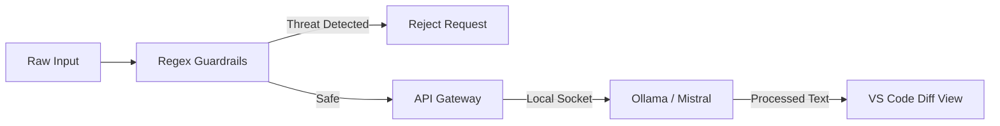

# .bridge.

<div align="center">

```text
        .  b  r  i  d  g  e  .
        [ localhost :: 11434 ]
```


**Deploy Empathy to Production.**

**The Universal Translator for Developers.**

</div>

---

## 1.0 SYNOPSIS

Your code is clean. Your architecture is solid. But your communication throws exceptions.

You write: `"This code is garbage. Fix it."`

The receiver hears: `"I hate you and I hate this company."`

**Result:** Friction. Meetings. Lost velocity.

`.bridge` is a localized, privacy-first translation layer between your brain and the rest of the world. It takes raw, technical, unfiltered input and compiles it into professional, clear communication.

**One keystroke. Zero latency.**

### Example

**Input (Raw):**
```
Database is dead again. Migration script killed the index. We need to rollback now or we are screwed.
```

**Output (Compiled):**
```
We are currently experiencing database stability issues caused by the recent migration. To restore service integrity, we are initiating an immediate rollback strategy.
```

---

## 2.0 SECURITY PROTOCOLS (PARANOID MODE)

We operate under a simple assumption: **Do not trust the cloud.**

This extension is built for air-gapped environments, regulated industries, and the privacy-conscious.

### 2.1 Localhost Exclusivity

Data never leaves the local machine. The extension communicates exclusively with your local AI instance via loopback sockets.

- **No Cloud APIs.**
- **No Telemetry.**
- **No External Calls.**

### 2.2 Attack Surface Hardening

This codebase has undergone a full-spectrum Red Team audit.

- **SSRF Protection:** Strict URL validation prevents internal network scanning via the extension.
- **Input Sanitization:** Regex guardrails actively block Prompt Injection, Leetspeak, and Unicode Homoglyph attacks.
- **DoS Mitigation:** Hard limits on input length (100k chars) and connection timeouts (60s).
- **Rate Limiting:** 10 requests/minute per session prevents resource exhaustion.
- **Encoding Detection:** Base64 and URL-encoding attempts are blocked before processing.

**Test Coverage:** 53+ security tests, 100% pass rate.

### 2.3 Enterprise Compliance

For restricted environments, IT Administrators can enforce configuration via `settings.json` to point to a centralized, secured inference server.

```json
{
  "bridge.apiBaseUrl": "http://internal-ai.corp:11434",
  "bridge.model": "mistral-hardened"
}
```

---

## 3.0 INSTALLATION

### 3.1 Dependencies

The engine requires a local AI service running (e.g., Ollama).

```bash
# 1. Install Ollama
curl -fsSL https://ollama.com/install.sh | sh

# 2. Pull the model (Mistral recommended for logic/reasoning)
ollama pull mistral

# 3. Start the service
ollama serve
```

### 3.2 Extension Setup

1. Download the `.vsix` file (from releases).
2. In VS Code, go to **Extensions**.
3. Click **...** (Views and More Actions) > **Install from VSIX...**.
4. Select the file. Done.

---

## 4.0 USAGE

1. Highlight text in VS Code (Code comments, READMEs, email drafts)
2. Execute command: `Cmd+Shift+B` (Mac) or `Ctrl+Shift+B` (Win/Linux)
3. Review the output in the side-by-side diff view

**Command:** `Bridge: Translate / Polish`

---

## 5.0 CONFIGURATION

Configure the protocol in your VS Code settings (`Cmd+,` / `Ctrl+,`).

| Setting | Default | Description |
|---------|---------|-------------|
| `bridge.model` | `mistral` | The local model to use (e.g., `mistral`, `llama3.2`, `qwen2.5-coder`) |
| `bridge.targetLanguage` | `English` | Output language. Set to `Swedish` for localization. |
| `bridge.apiBaseUrl` | `http://localhost:11434` | Override for remote/centralized inference servers. |

---

## 6.0 ARCHITECTURE



### Security Layers (Defense in Depth)

1. **Rate Limiting** - Prevents DoS
2. **Input Length Check** - Max 100k characters
3. **Encoding Detection** - Base64, URL-encoding
4. **Unicode Normalization** - NFKC + homoglyph mapping
5. **Leetspeak Normalization** - 0→o, 1→i, 3→e, etc.
6. **Bidirectional Text Fix** - RTL detection and reversal
7. **Regex Pattern Matching** - 9 security patterns
8. **SSRF URL Validation** - Protocol and hostname validation
9. **Output Sanitization** - Cleans leakage from AI

---

## 7.0 TROUBLESHOOTING

### "Could not connect to local AI"

- Verify that your local AI service is running (e.g., `ollama serve`)
- Check that the model is installed: `ollama list`
- Verify `bridge.apiBaseUrl` in VS Code Settings

### Extension not responding

- Ensure text is selected before executing command
- Check that `bridge.model` is correctly configured
- Verify local AI service is accessible at configured `apiBaseUrl`

---

## 8.0 SEE ALSO

- [Security Final Report](./SECURITY_FINAL_REPORT.md) - Complete audit documentation
- [Ollama Documentation](https://ollama.com/docs) - Local AI setup guide

---

**EOF**
